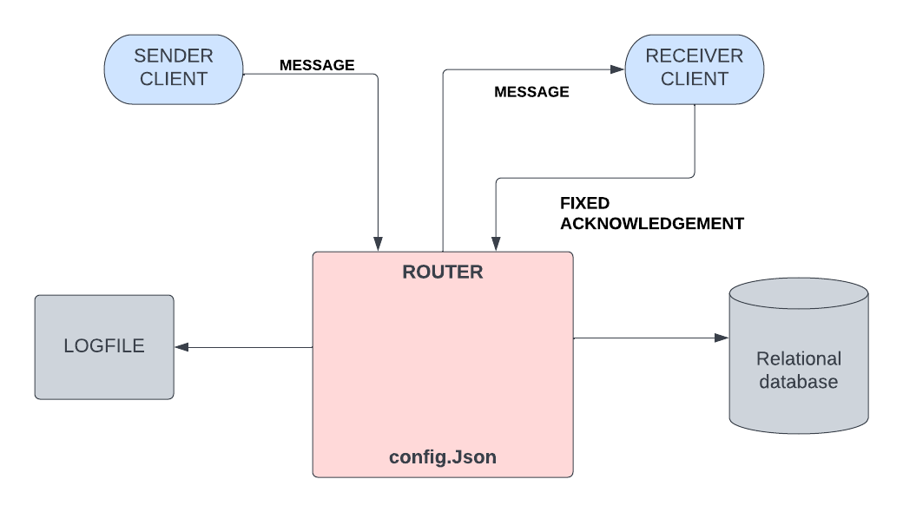
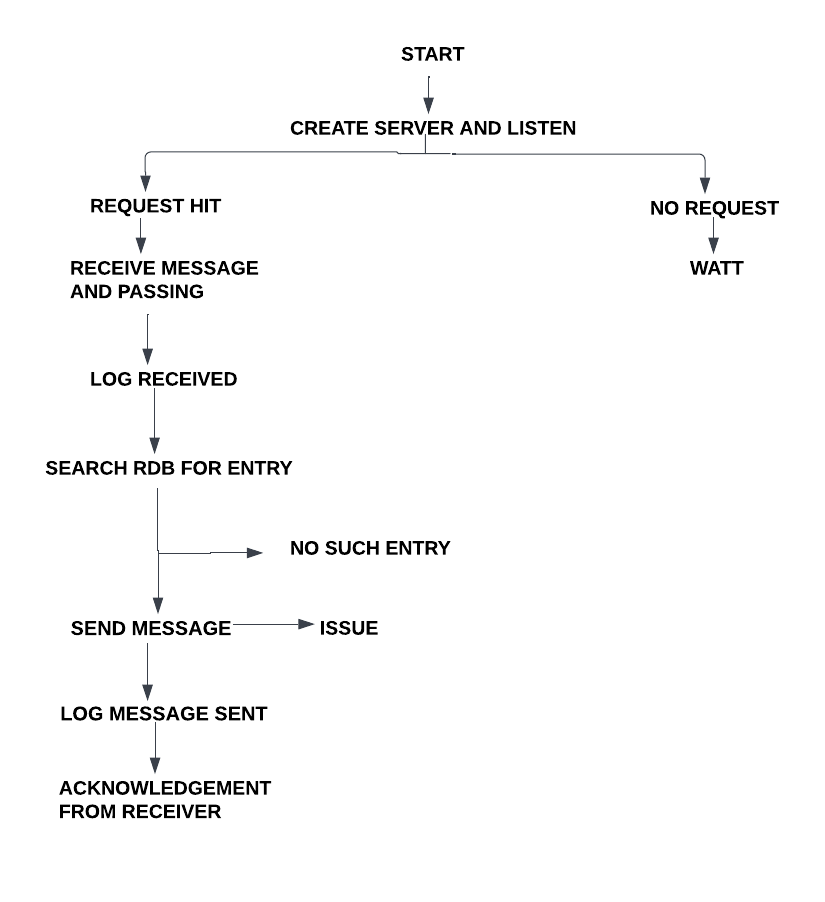
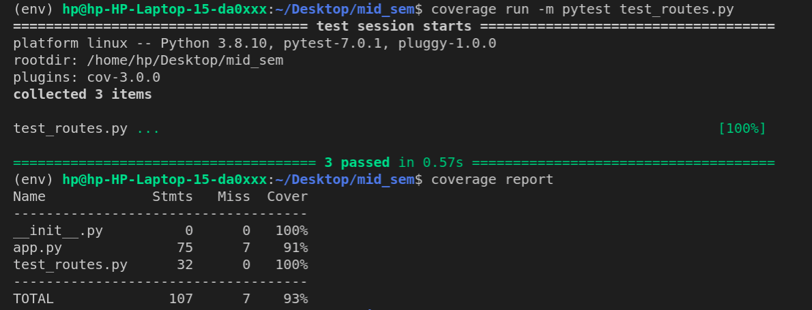
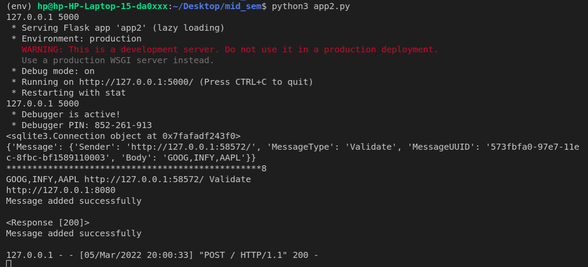

# CS-305 Mid-Semester Examination

=================================

Submitter name: Preetesh Verma

Roll Number: 2018eeb1171

Course: Software Engineering 

=================================


## Problem Statement

As part of the problem statement we were asked to design and develop a message router service so that there can be n number of clients who could exchange messages over HTTP server. The message exchange occurs asynchronously via a message router service only. That is, the client  services can not directly contact each other. We also have to use a database service in order to get destination address from the message body passed by the sender.

The problem statement had the following main components:
1. Router Server 
2. Request Client
3. Routing and Message database 

Thus, the problem statement asked us to create a scenario to mimic a mesage router service where our server would listen on a particular port to client's request of communication with each other and try to carry them out. The server shall be connected to a relational database to get the destination address using the <sender, message_type> as the key. Also, the receiver (i.e., the final destination) of the message always sends an acknowledgement message back to the sender on successful receipt of the message.


## Approach to Solution

### Overview

As part of the solution, first I am creating a server service which would be listening to the client requests and transmitting them according to the message it receives. After creating the server I connected it to the Relational Database which already had tables for Routing and Log Message Table with schemas for both provided in the question. For connecting I used config.json file which also contains the Port Number, Host Details and Log File locaiton. 
After that I created a receiver which would send me requests to transfer message. In the requests I would be getting the sender and Message Type using which I could get the Destination Address from the Routing Table in the Database. Then after receiving the message I logged that message onto the Logging Table and then Sent the Request message to the destination and on successful sending logged it as well.
The receiver acknowledged the message by responding "Hello World".
The assignment consumes POST Type request and sends messages to the receiver. The message are generally in the XML with few specified fields such as "Body", "Sender" etc which help in parsing it. We were also asked to log messages in a log file.
Here is a general diagram of the entire operation as part of the quesiton:


### Directory Structure
Here is the main directory structure:

```

├── app2.py
├── app.py
├── config.json
├── database.db
├── data.xml
├── requirements.txt
├── env
├── ReadMe.md
├── receiver.py
├── sender.py
├── images
    ├── 
    ├── 
    ├── 
└── test_routes.py

```

### Detailed Explanation of the solution and contents of each file

### app2.py
This file is responsible for creating the flask server for message routing.
This file serves as the higher level abstraction for the app2.py which contains all the inner working of the flask server.

### app.py
This file contains the bulk of the code responsible for running the server. First after receiving an instance of the app object it connects to the Relational Database and listens to the request on receving which it would parse the XML message and then get the Destination Address and look for it in the Database and on receiving it the server then tries to send the message to the receiver. There are several helper functions which carry out individual small tasks such as XML parsing, json Parsing, Database connection  etc.

The code flow is somewhat like this in the flow chart:


### sender.py
This file contains the sample sender script created by me which just sends a request to the server once the server is running. It takes the data.xml file as the message and sends it to the server after parsing it to a json file since requests in python does not support passing of XML content directly.

### receiver.py
This file behaves as the reciver and is an implementation of the flask server which just listens on the destination port number waiting for the server to send the message and on receiving the message it sends an acknowledgment back to the server.

### test_routes.py

This is the file contating the unit tests written by me to test the code.
I have used Pytest library to test the working. First of all I am creating a flask app in the file and then call different funciton using the same.
The test_routes file is enough to run and carry out any possible request.
One of the test cases is a complete success which covers most of the code and is the entire procedure of running the message router server. Other test cases test other often used funcitons written by me.
The code coverage is over 91% for the app.py file which contains all the important code.


## Procedure to run the files
The technology stack used by me is Python + pytest + Coverage.py + Flask .
The procedure to work on the assignment is as follows:
1) Downlaod the zip file.
2) Extract the contents of the zip file and install all the necessary dependents using the requirements.txt.The command for the same is 

```
pip install requirements.txt
```

3) One needs to then go to the config file and make the database changes first and then logFile changes.Do not change the location of the config file.

4) For the destination address since it can be different we would have to change it in the receiver file. The destination address is the address on which the server is continously listening from the server. In my database the destination address was http://127.0.0.1:8080/ . If in the user's database it is differnet then kindly change it in the receiver.py file at line 22 by providing the host and port number.

(Note for certain linux systems it is pip3).
5) After installing the dependencies one needs to run the test file which can be done by using the command:
```
coverage run -m pytest test_routes.py
```
This would successfully run the test file.
To see the code coverage use"
```
coverage report
```
Now another way to see the working of the code is ::
Start the server file in one terminal using the command:
```
python app2.py
```
Then start the receiver file
```
python receiver.py
```
These two are flask servers and would continously run on their own.
Then run the sender script
```
python sender.py
```
This would terminate with a response of <Response 200> meaning it successfully executed.


### Certain Design Approaches and Solid Principles
These were certain approaches used by me in the completion of this code.

1) The Single-responsibility principle (SRP)
“A class should have one, and only one, reason to change”
In other words, every component of our code (in general a class, but also a function) should have one and only one responsibility. As a consequence of that, there should be only a reason to change it.
This helps in localizing the errors and reusing the code.

2) The Open–closed principle (OCP)
“Software entities … should be open for extension but closed for modification”
In other words: We should not need to modify the code you have already written to accommodate new functionality, but simply add what we now need.

3) Interface Segregation Principle
"Many client-specific interfaces are better than one general-purpose interface."
When we use functions from a module,we are using the disposed interface of that module, even if we are in a dynamically typed language, that interface still exists.We should provide one clear way of doing things instead of many, and we should expose only what is necessary for the users to perform the specific task.

4) Decorator Pattern
The decorator pattern is a design pattern that allows behavior to be added to an individual object, dynamically, without affecting the behavior of other objects from the same class. The decorator pattern is often useful for adhering to the Single Responsibility Principle, as it allows functionality to be divided between classes with unique areas of concern.


### Snapshots of the results

Program running and testing


Server Running



## Results

Name             Stmts   Miss  Cover
------------------------------------
app.py              75      7    91%
test_routes.py      32      0   100%
------------------------------------
TOTAL              107      7    93%


## References
