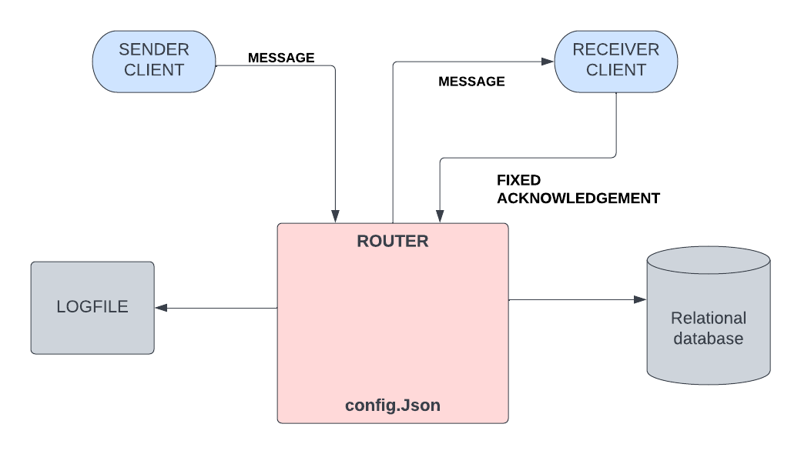
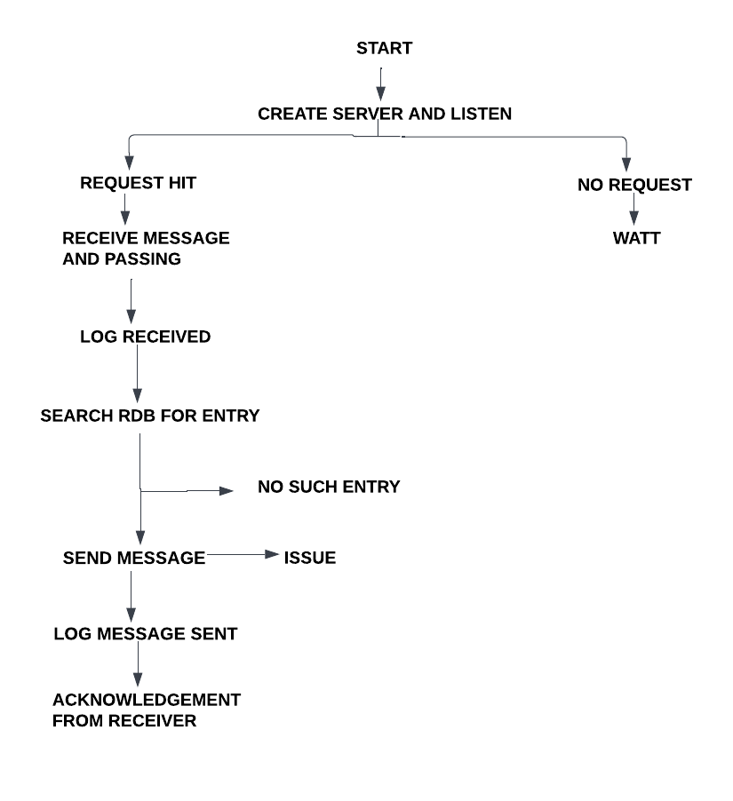
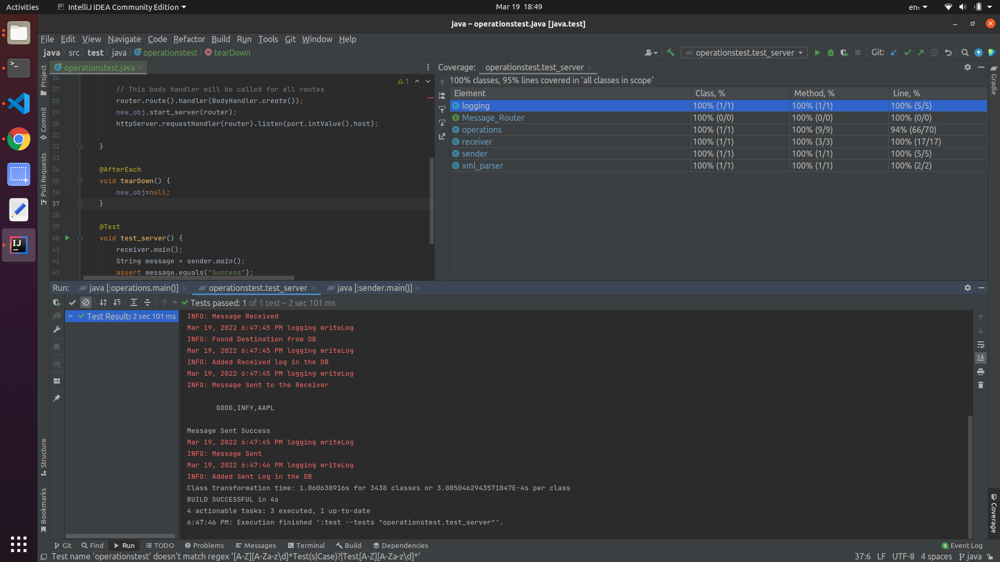

# CS-305 Mid-Semester Examination

=================================

Submitter name: Preetesh Verma

Roll Number: 2018eeb1171

Course: Software Engineering 

=================================

## Problem Statement

As part of the problem statement, we were asked to design and develop a message router service so that there can be n number of clients who could exchange messages over an HTTP server. The message exchange occurs asynchronously via a message router service only. That is, the client services can not directly contact each other. We also have to use a database service to get the destination address from the message body passed by the sender.

The problem statement had the following main components:
1. Router Server 
2. Request Client
3. Routing and Message database 

Thus, the problem statement asked us to create a scenario to mimic a message router service where our server would listen on a particular port to the client's requests of communication with each other and try to carry them out. The server shall be connected to a relational database to get the destination address using the <sender, message_type> as the key. Also, the receiver (i.e., the final destination) of the message always sends an acknowledgement message back to the sender on successful receipt of the message.

## Approach to Solution

### Overview

As part of the solution, first I am creating a server service that would be listening to the client requests and transmitting them according to the message it receives. After creating the server I connected it to the Relational Database which already had tables for Routing and Log Message Table with schemas for both provided in the question. For connecting I used the config.json file which also contains the Port Number, Host Details and Log File location. 
After that, I created a receiver that would send me requests to transfer messages. In the requests I would be getting the sender and Message Type using which I could get the Destination Address from the Routing Table in the Database. Then after receiving the message I logged that message onto the Logging Table and then Sent the Request message to the destination and on successful sending logged it as well.
The receiver acknowledged the message by responding "Success".
The assignment consumes POST Type request and sends messages to the receiver. The message are generally in the XML with few specified fields such as "Body", "Sender" etc which help in parsing it. We were also asked to log messages in a log file.
Here is a general diagram of the entire operation as part of the quesiton:

### Detailed Explanation of the solution and contents of each file

### operations.java
This file is responsible for creating the Vertx server for message routing.
This file uses the higher-level abstraction from the abstraction which contains all the inner working of the server.
This file contains the bulk of the code responsible for running the server. First, after receiving an instance of the app object it connects to the Relational Database and listens to the request on receiving which it would parse the XML message and then get the Destination Address and look for it in the Database and on receiving it the server then tries to send the message to the receiver. There are several helper functions that carry out individual small tasks such as XML parsing, JSON Parsing, Database connection etc.

The code flow is somewhat like this in the flow chart:

### sender.java
This file contains the sample sender script created by me which just sends a request to the server once the server is running. It takes the data.xml file's content as the message and sends it to the server after parsing it to a JSON file since requests in Java does not support the passing of XML content directly.

### receiver.java
This file behaves as the receiver and is an implementation of the Vertx server which just listens on the destination port number waiting for the server to send the message and on receiving the message it sends an acknowledgement back to the server.

### testOperations.java
This is the file containing the unit tests written by me to test the code.
I have used the Junit library to test the work. First of all, I am creating a Vertx server app in the file and then calling different functions using the same.
The test_routes file is enough to run and carry out any possible request.
One of the test cases is a complete success which covers most of the code and is the entire procedure of running the message router server. Other test cases test other often used functions written by me.
The code coverage is over 96% for the app.py file which contains all the important code.

### database.db
It contains the database of the quesiton with two tables.

### f.log
This is the logging file used by me.

## Procedure to run the files
The technology stack used by me is Java + JUnit + Vertx + IntelliJ .
The procedure to work on the assignment is as follows:
1) Download the zip file.
2) Extract the contents of the zip file and then create a virtual python environment (not necessary ) using the run button.

5) For the destination address if it is different we would have to change it in the receiver file. The destination address is the address on which the receiver is continuously listening from the server module. In my database the destination address was http://127.0.0.1:8080/ . If in the user's database it is different then kindly change it in the receiver.java file at line 22 by providing the host and port number and then run the file.
My database had the following entries for the routing table.I have provided my database as well in database.db file.

RouteID|Sender|MessageType|Destination|
--- | --- | --- | --- |
1|http://127.0.0.1:23001/foo|Validate|http://127.0.0.1:8080|
2|http://127.0.0.1:58572/|Validate|http://127.0.0.1:8080|
2|http://127.0.0.1:58572|Validate|http://127.0.0.1:8080|

### Snapshots of the results

Program running and testing

